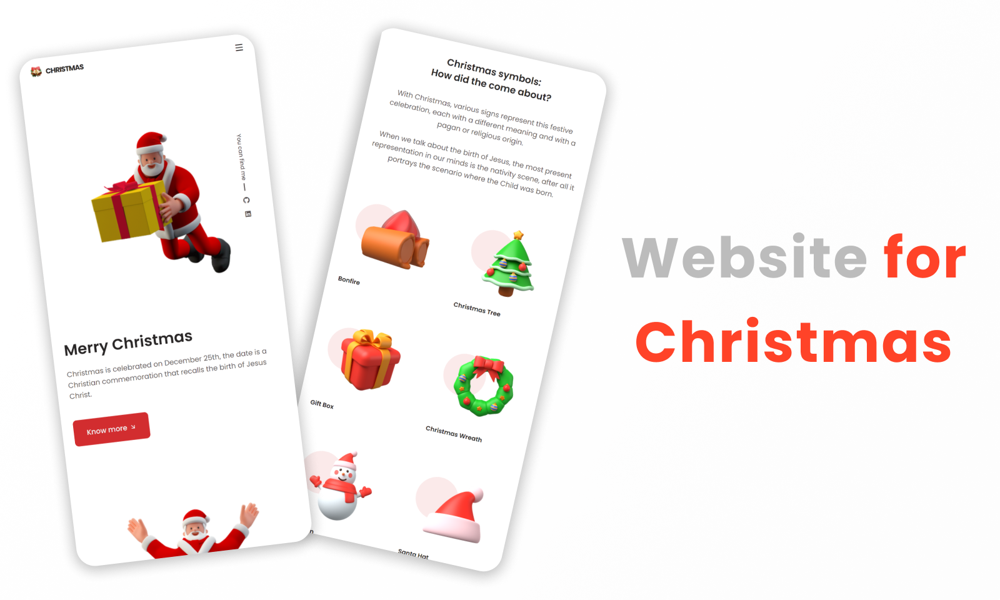

<h1 align="center">🎅 Website for Christmas</h1>

  <strong>Site para o Natal</strong>

  

### Site 💻

- [Website for Christmas](https://website-christmas.netlify.app/)

## Linguagens: 🚀

- HTML
- CSS
- JavaScript

## Referências: ⌨️

- [IconFinder](https://www.iconfinder.com/)
- [Iconscout](https://iconscout.com/)
